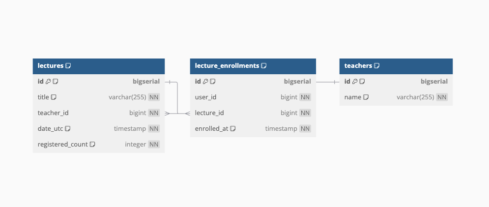

# 엔터티-관계 다이어그램 (ERD)



## 테이블 정의

### 1. 특강 테이블 (`lectures`)

```sql
CREATE TABLE lectures (
    id BIGSERIAL PRIMARY KEY,
    title VARCHAR(255) NOT NULL,
    teacher_id BIGINT NOT NULL,
    date_utc TIMESTAMP NOT NULL,
    registered_count INTEGER NOT NULL DEFAULT 0,
);

CREATE INDEX idx_lectures_title ON lectures(title);
CREATE INDEX idx_lectures_date_utc ON lectures(date_utc);
```

---

### 2. 특강 신청 내역 테이블 (`lecture_enrollments`)

```sql
CREATE TABLE lecture_enrollments (
    id BIGSERIAL PRIMARY KEY,
    user_id BIGINT NOT NULL,
    lecture_id BIGINT NOT NULL,
    enrolled_at TIMESTAMP NOT NULL,
);

CREATE INDEX idx_lecture_enrollments_user_id ON lecture_enrollments(user_id);
CREATE INDEX idx_lecture_enrollments_lecture_id ON lecture_enrollments(lecture_id);
CREATE UNIQUE INDEX uq_lecture_enrollments_user_lecture ON lecture_enrollments(user_id, lecture_id);
```

---

### 3. 강연자 테이블 (`teachers`)

```sql
CREATE TABLE teachers (
    id BIGSERIAL PRIMARY KEY,
    name VARCHAR(255) NOT NULL
);

CREATE INDEX idx_teachers_name ON teachers(name);
```

## 테이블 설명

### 1. 특강 테이블 (`lectures`)

**목적:**
각 특강에 대한 정보를 저장하며, 제목, 강연자, 일정, 현재 신청 인원을 관리합니다.

**설계 고려사항:**

- **id:**
  - 자동 증가하는 고유 식별자로 설정하여 관리의 편의성을 높였습니다.

- **title:**
  - 특강의 제목을 저장하며, 최대 255자의 문자열로 제한하였습니다.

- **teacher_id:**
  - 강연자의 식별자를 저장하며, `teachers` 테이블의 `id`와 외래 키 관계를 맺었습니다.

- **date_utc:**
  - 특강이 진행되는 시간을 UTC 기준의 `TIMESTAMP`로 저장합니다.
  - 시간대 변환이 필요한 경우 애플리케이션 레벨에서 처리합니다.

- **registered_count:**
  - 현재 특강에 신청된 인원 수를 저장합니다.
  - 동시성 이슈를 최소화하기 위해 이 필드를 사용하여 신청 가능 여부를 빠르게 판단합니다.

- **인덱스:**
  - `title`과 `date_utc`에 인덱스를 생성하여 검색 성능을 향상시켰습니다.

---

### 2. 특강 신청 내역 테이블 (`lecture_enrollments`)

**목적:**
사용자가 어떤 특강에 언제 신청했는지를 기록합니다.

**설계 고려사항:**

- **id:**
  - 자동 증가하는 고유 식별자로 설정하였습니다.

- **user_id, lecture_id:**
  - 각각 사용자와 특강의 식별자를 저장합니다.
  - `lecture_id`는 `lectures` 테이블의 `id`와 외래 키 관계를 맺었습니다.

- **enrolled_at:**
  - 사용자가 특강을 신청한 시각을 기록합니다.

- **인덱스 및 제약 조건:**
  - `user_id`와 `lecture_id`에 인덱스를 생성하여 검색 성능을 향상시켰습니다.
  - `UNIQUE INDEX`를 생성하여 동일한 사용자가 동일한 특강에 중복 신청하지 못하도록 제약을 추가하였습니다.

---

### 3. 강연자 테이블 (`teachers`)

**목적:**
강연자의 정보를 저장합니다.

**설계 고려사항:**

- **id:**
  - 자동 증가하는 고유 식별자로 설정하였습니다.

- **name:**
  - 강연자의 이름을 저장하며, 최대 255자의 문자열로 제한하였습니다.

- **인덱스:**
  - `name`에 인덱스를 생성하여 강연자 검색 시 성능을 향상시켰습니다.

---

## 테이블 관계

- **`lectures` ↔ `teachers`:**
  - `lectures.teacher_id`는 `teachers.id`를 참조하며, 각 특강은 하나의 강연자와 연결됩니다.

- **`lecture_enrollments` ↔ `lectures`:**
  - `lecture_enrollments.lecture_id`는 `lectures.id`를 참조하며, 각 신청 내역은 하나의 특강과 연결됩니다.

---

## 설계 원칙

### 정규화

- **데이터 중복 최소화:**
  - 각 테이블은 고유한 책임을 가지며, 중복 데이터를 저장하지 않습니다.
  - 관계를 통해 필요한 정보를 조합하여 사용합니다.

- **데이터 무결성:**
  - 외래 키 제약 조건을 사용하여 데이터 간의 참조 무결성을 유지합니다.

### 확장성 및 성능

- **인덱스 적용:**
  - 자주 조회되는 필드에 인덱스를 적용하여 대용량 데이터에서도 빠른 검색이 가능합니다.

- **스키마 확장 용이성:**
  - 새로운 요구사항에 따라 테이블과 필드를 추가하거나 수정하기 쉽게 설계되었습니다.

### 동시성 제어

- **동시성 관리:**
  - `registered_count` 필드를 사용하여 동시에 여러 사용자가 특강을 신청할 때 발생할 수 있는 경쟁 조건을 방지합니다.
  - 데이터베이스 수준에서의 적절한 트랜잭션 격리 수준을 설정하여 데이터 일관성을 유지합니다.

- **원자성 보장:**
  - 신청 과정에서 트랜잭션을 사용하여 모든 데이터 변경이 원자적으로 처리되도록 합니다.

### 비즈니스 로직 구현 지원

- **신청 가능 인원 확인:**
  - `registered_count`와 애플리케이션 로직을 통해 최대 신청 인원 제한을 관리합니다.

- **중복 신청 방지:**
  - `lecture_enrollments` 테이블에서 `(user_id, lecture_id)` 조합에 대한 고유 인덱스를 통해 동일한 사용자의 중복 신청을 방지합니다.
